# Comprehensive Pine Script Project Scoping System

## The Challenge

Pine Script projects can involve:
- Custom data sources (economic data, alternative data feeds)
- Machine learning integrations
- Complex mathematical models (wavelets, fourier transforms, neural networks)
- Custom chart types (Renko, Kagi, Point & Figure, Market Profile)
- Options pricing models (Black-Scholes, Greeks calculations)
- Cryptocurrency-specific features (funding rates, liquidations, order book analysis)
- Forex correlations and currency strength meters
- Market microstructure analysis (order flow, volume profile, footprint charts)
- Statistical arbitrage and cointegration
- Seasonal patterns and calendar anomalies
- Custom risk models (VaR, CVaR, Kelly Criterion)
- Social sentiment integration
- News event trading
- Custom backtesting frameworks
- Monte Carlo simulations
- Walk-forward optimization
- Multi-broker integration
- Custom execution algorithms
- And hundreds more variations...

## The Solution: Adaptive Scoping with Fallback

```mermaid
flowchart TD
    Start([User Request]) --> Parse{Can Parse<br/>Request Type?}
    
    Parse -->|Yes| Known[Known Pattern Flow]
    Parse -->|No| Unknown[Unknown Pattern Handler]
    
    %% Known Pattern Branch
    Known --> StandardQ[Standard Questions]
    StandardQ --> SpecificQ[Type-Specific Questions]
    
    %% Unknown Pattern Branch
    Unknown --> Probe1{What are you<br/>trying to achieve?}
    Probe1 --> Analyze[Analyze Keywords]
    
    Analyze --> Categories{Identify<br/>Categories}
    
    Categories --> DataCat[Data/Input Related]
    Categories --> CalcCat[Calculation/Logic Related]
    Categories --> DisplayCat[Display/Output Related]
    Categories --> TradeCat[Trading/Execution Related]
    Categories --> IntegrationCat[Integration Related]
    Categories --> CustomCat[Completely Custom]
    
    %% Data Category Deep Dive
    DataCat --> DataQ{What data sources?}
    DataQ --> StandardData[OHLCV]
    DataQ --> AltData[Alternative Data]
    DataQ --> MultiAsset[Multiple Assets]
    DataQ --> CustomData[Custom Data Feed]
    
    AltData --> AltDetail{Specify data type}
    AltDetail --> Economic[Economic Indicators]
    AltDetail --> Sentiment[Social/News Sentiment]
    AltDetail --> OnChain[Blockchain Data]
    AltDetail --> OrderBook[Market Depth]
    AltDetail --> Options[Options Chain]
    AltDetail --> Other1[Other - Describe]
    
    %% Calculation Category Deep Dive
    CalcCat --> CalcQ{What calculations?}
    CalcQ --> StandardCalc[Standard TA]
    CalcQ --> AdvancedMath[Advanced Math]
    CalcQ --> MLCalc[Machine Learning]
    CalcQ --> StatCalc[Statistical Models]
    CalcQ --> CustomCalc[Custom Algorithm]
    
    AdvancedMath --> MathDetail{Which type?}
    MathDetail --> Fourier[Fourier/Wavelets]
    MathDetail --> LinAlg[Linear Algebra]
    MathDetail --> Probability[Probability Models]
    MathDetail --> Optimization[Optimization Algos]
    MathDetail --> Other2[Other - Describe]
    
    MLCalc --> MLDetail{ML Approach?}
    MLDetail --> Classification[Classification]
    MLDetail --> Regression[Regression]
    MLDetail --> Clustering[Clustering]
    MLDetail --> NeuralNet[Neural Networks]
    MLDetail --> Other3[Other - Describe]
    
    %% Display Category Deep Dive
    DisplayCat --> DisplayQ{Display requirements?}
    DisplayQ --> ChartType[Special Chart Types]
    DisplayQ --> Heatmaps[Heatmaps/Matrices]
    DisplayQ --> Dashboard[Dashboard/Tables]
    DisplayQ --> Custom3D[3D/Advanced Viz]
    DisplayQ --> Other4[Other - Describe]
    
    ChartType --> ChartDetail{Which chart type?}
    ChartDetail --> Renko[Renko]
    ChartDetail --> Kagi[Kagi]
    ChartDetail --> PnF[Point & Figure]
    ChartDetail --> MarketProfile[Market Profile]
    ChartDetail --> Footprint[Footprint]
    ChartDetail --> OrderFlow[Order Flow]
    ChartDetail --> Other5[Other - Describe]
    
    %% Trading Category Deep Dive
    TradeCat --> TradeQ{Trading approach?}
    TradeQ --> StandardTrade[Standard Long/Short]
    TradeQ --> ComplexTrade[Complex Execution]
    
    ComplexTrade --> ComplexDetail{Specify complexity}
    ComplexDetail --> Pairs[Pairs/Spread Trading]
    ComplexDetail --> Basket[Basket Trading]
    ComplexDetail --> Options2[Options Strategies]
    ComplexDetail --> Arbitrage[Arbitrage]
    ComplexDetail --> MarketMaking[Market Making]
    ComplexDetail --> HFT[High Frequency]
    ComplexDetail --> Other6[Other - Describe]
    
    %% Integration Category
    IntegrationCat --> IntQ{Integration with?}
    IntQ --> Brokers[Multiple Brokers]
    IntQ --> Database[Database Systems]
    IntQ --> APIs[External APIs]
    IntQ --> Blockchain[Blockchain/DeFi]
    IntQ --> Other7[Other - Describe]
    
    %% Custom Category - Full Discovery
    CustomCat --> Discovery[Full Discovery Mode]
    
    Discovery --> D1{Describe your idea<br/>in detail}
    D1 --> D2{What problem does<br/>it solve?}
    D2 --> D3{What inputs does<br/>it need?}
    D3 --> D4{What outputs should<br/>it produce?}
    D4 --> D5{Any similar<br/>existing tools?}
    D5 --> D6{Special requirements?}
    
    %% Convergence Point
    StandardData --> Requirements
    CustomData --> Requirements
    Economic --> Requirements
    Sentiment --> Requirements
    OnChain --> Requirements
    OrderBook --> Requirements
    Options --> Requirements
    Other1 --> Requirements
    
    StandardCalc --> Requirements
    Fourier --> Requirements
    LinAlg --> Requirements
    Probability --> Requirements
    Optimization --> Requirements
    Other2 --> Requirements
    
    Classification --> Requirements
    Regression --> Requirements
    Clustering --> Requirements
    NeuralNet --> Requirements
    Other3 --> Requirements
    
    Renko --> Requirements
    Kagi --> Requirements
    PnF --> Requirements
    MarketProfile --> Requirements
    Footprint --> Requirements
    OrderFlow --> Requirements
    Other4 --> Requirements
    Other5 --> Requirements
    
    StandardTrade --> Requirements
    Pairs --> Requirements
    Basket --> Requirements
    Options2 --> Requirements
    Arbitrage --> Requirements
    MarketMaking --> Requirements
    HFT --> Requirements
    Other6 --> Requirements
    
    Brokers --> Requirements
    Database --> Requirements
    APIs --> Requirements
    Blockchain --> Requirements
    Other7 --> Requirements
    
    D6 --> Requirements
    
    Requirements[Compile Requirements] --> Feasibility{Feasible in<br/>Pine Script?}
    
    Feasibility -->|Yes| GenerateSpec[Generate Specification]
    Feasibility -->|Partially| Workaround[Design Workarounds]
    Feasibility -->|No| Alternative[Suggest Alternatives]
    
    Workaround --> GenerateSpec
    Alternative --> Reconsider[Reconsider Approach]
    Reconsider --> Parse
    
    GenerateSpec --> FinalSpec[["
    📋 PROJECT SPECIFICATION
    ========================
    Core Concept: [Description]
    Category: [Primary category]
    Sub-categories: [All relevant]
    
    Data Requirements:
    - Sources: [List all]
    - Frequency: [Tick/Second/Minute/etc]
    - History needed: [Bars required]
    
    Calculations:
    - Primary: [Main calculations]
    - Secondary: [Supporting calcs]
    - Complexity: [Simple/Advanced/Custom]
    
    Display Requirements:
    - Type: [Charts/Tables/Mixed]
    - Updates: [Realtime/Bar close]
    - Interactivity: [If any]
    
    Trading Logic:
    - Type: [Manual/Auto/Both]
    - Complexity: [Standard/Custom]
    - Risk Management: [Requirements]
    
    Technical Constraints:
    - Pine limitations: [List relevant]
    - Workarounds needed: [If any]
    - Performance concerns: [If any]
    
    Implementation Plan:
    - Feasible features: [List]
    - Compromises: [If any]
    - Alternatives: [For unfeasible parts]
    
    File: [descriptive-name].pine
    Agents: [Required agents]
    Templates: [If applicable]
    Custom Development: [What's needed]
    Estimated Complexity: [1-10 scale]
    "]]
```



## Adaptive Question Framework

### Level 1: Initial Probe
If user request doesn't match known patterns, ask:
1. "Can you describe what you're trying to achieve?"
2. "What problem are you trying to solve?"
3. "Is this for analysis, trading, or something else?"

### Level 2: Category Discovery
Based on initial response, identify categories:
- **Data/Input**: Custom data sources, multiple timeframes, alternative data
- **Calculation/Logic**: Mathematical models, ML, statistical analysis
- **Display/Output**: Visualization, custom charts, dashboards
- **Trading/Execution**: Order management, position sizing, complex strategies
- **Integration**: External systems, APIs, databases

### Level 3: Deep Dive Questions

#### For Unknown Data Sources:
- "What type of data? (price, volume, sentiment, on-chain, economic, other)"
- "How frequently does it update?"
- "How will you get this data into TradingView?"
- "Can we approximate it with available data?"

#### For Unknown Calculations:
- "Can you describe the mathematical formula or logic?"
- "Does this exist in other platforms? Which ones?"
- "What are the inputs and outputs?"
- "Is there a simpler version we could start with?"

#### For Unknown Visualizations:
- "Can you describe or sketch what it should look like?"
- "Have you seen this elsewhere? Where?"
- "What information must be displayed?"
- "How should it update?"

#### For Unknown Trading Logic:
- "Describe your entry and exit conditions"
- "How do you manage risk?"
- "What's unique about your approach?"
- "Any special execution requirements?"

### Level 4: Feasibility Assessment

After gathering requirements, assess:
1. **Fully Feasible**: Can be done in Pine Script as requested
2. **Partially Feasible**: Some compromises needed
3. **Requires Workarounds**: Creative solutions needed
4. **Not Feasible**: Need alternative approach

## Examples of Handling Unknown Requests

### Example 1: "I want to analyze options flow"
**Discovery Process**:
1. What aspect of options flow? → "Unusual options activity"
2. What data needed? → "Volume, OI, strike, expiry"
3. How to get in TradingView? → "Can't directly"
4. Workaround? → "Use volume patterns as proxy, add manual levels"
5. Result: Partial implementation with manual input method

### Example 2: "I need Elliott Wave with AI"
**Discovery Process**:
1. What should the AI do? → "Identify wave patterns"
2. How sophisticated? → "Basic pattern recognition"
3. Training data? → "Historical patterns"
4. Workaround: Rule-based pattern matching with probability scores
5. Result: Feasible with simplified approach

### Example 3: "Market making bot for DeFi"
**Discovery Process**:
1. Which blockchain? → "Ethereum"
2. How to connect? → "Via webhooks to bot"
3. Pine Script role? → "Signal generation only"
4. Result: Pine generates signals, external bot executes

### Example 4: "Fourier transform for cycle analysis"
**Discovery Process**:
1. Which type? → "DFT for dominant cycle"
2. Purpose? → "Find market cycles"
3. Approximation OK? → "Yes"
4. Result: Implement simplified DFT with limitations noted

## Fallback Strategies

When something is truly impossible in Pine Script:

### 1. Suggest Alternatives
- "Pine Script can't do X, but we can achieve similar results with Y"
- "Instead of real-time options data, we can use implied volatility proxies"
- "Rather than ML training, we can implement pre-trained rules"

### 2. Hybrid Approach
- "Pine Script for signals, external system for execution"
- "Manual data input for unavailable feeds"
- "Simplified visualization with detailed alerts"

### 3. Progressive Enhancement
- "Start with basic version, add features iteratively"
- "Build modular system that can be extended"
- "Create framework for future additions"

### 4. Educational Pivot
- "Here's why Pine Script has this limitation"
- "Here's what IS possible that's similar"
- "Here's how professionals handle this"

## The Universal Catch-All

If still uncertain after discovery:
```
"I understand you want [summary of request]. Pine Script has some limitations, 
but let's explore what's possible:

1. Core Functionality: What absolutely must work?
2. Nice-to-Have: What would be ideal but not essential?
3. Acceptable Compromises: Where can we simplify?
4. External Components: What could be handled outside Pine Script?

Based on your priorities, I'll design the best possible solution within 
Pine Script's capabilities, and clearly document any limitations or 
workarounds needed."
```

## Implementation in pine-manager

The pine-manager should:
1. First attempt to match known patterns
2. If no match, enter discovery mode
3. Ask probing questions to understand the request
4. Assess feasibility in Pine Script
5. Design workarounds or alternatives as needed
6. Generate realistic specification
7. Set appropriate expectations
8. Proceed with adapted implementation