# Pine Script Project Scoping Flow

This deterministic flow diagram helps the pine-manager agent gather the minimum necessary information to properly scope any Pine Script project.

## Flow Diagram

```mermaid
flowchart TD
    Start([User wants to create Pine Script]) --> Q1{Script Type?}
    
    %% Main Type Branch
    Q1 -->|Indicator| IND[Indicator Path]
    Q1 -->|Strategy| STRAT[Strategy Path]
    Q1 -->|Library| LIB[Library Path]
    Q1 -->|Not sure| HELP1[Explain Options]
    
    HELP1 --> Q1
    
    %% INDICATOR PATH
    IND --> Q2{Primary Purpose?}
    Q2 -->|Signal Generation| SIG[Signals/Alerts]
    Q2 -->|Information Display| INFO[Visual Information]
    Q2 -->|Both| BOTH1[Hybrid Indicator]
    Q2 -->|Not sure| HELP2[Explain: Signals vs Info]
    
    HELP2 --> Q2
    
    %% Signal Path
    SIG --> Q3{Signal Complexity?}
    Q3 -->|Simple<br/>Single condition| SIGSIMPLE[Simple Signals]
    Q3 -->|Complex<br/>Multiple conditions| SIGCOMPLEX[Complex Signals]
    Q3 -->|Multi-timeframe| SIGMTF[MTF Signals]
    
    %% Info Display Path
    INFO --> Q4{Display Type?}
    Q4 -->|Overlays<br/>On price chart| OVERLAY[Overlay Display]
    Q4 -->|Oscillator<br/>Separate pane| OSC[Oscillator Display]
    Q4 -->|Tables/Labels| TABLES[Data Tables]
    Q4 -->|Mixed| MIXED[Multiple Display Types]
    
    %% STRATEGY PATH
    STRAT --> Q5{Trading Complexity?}
    Q5 -->|Standard<br/>Long/Short one asset| STANDARD[Standard Strategy]
    Q5 -->|Complex<br/>Multiple assets/hedging| COMPLEX[Complex Strategy]
    Q5 -->|Not sure| HELP3[Explain Strategy Types]
    
    HELP3 --> Q5
    
    %% Standard Strategy
    STANDARD --> Q6{Use TradingView<br/>Strategy Functions?}
    Q6 -->|Yes| TVSTRAT[TV Strategy Framework]
    Q6 -->|No<br/>Custom logic only| CUSTOM[Custom Framework]
    
    %% Complex Strategy
    COMPLEX --> Q7{Complex Features?}
    Q7 -->|Pairs Trading| PAIRS[Pairs Trading Setup]
    Q7 -->|Hedging<br/>Long+Short same asset| HEDGE[Hedging Setup]
    Q7 -->|Portfolio<br/>Multiple assets| PORTFOLIO[Portfolio Setup]
    Q7 -->|Grid/DCA| GRID[Grid Trading Setup]
    
    %% LIBRARY PATH
    LIB --> Q8{Library Type?}
    Q8 -->|Calculation Functions| LIBCALC[Calculation Library]
    Q8 -->|Drawing Functions| LIBDRAW[Drawing Library]
    Q8 -->|Utility Functions| LIBUTIL[Utility Library]
    
    %% COMMON QUESTIONS FOR ALL PATHS
    SIGSIMPLE --> Q9
    SIGCOMPLEX --> Q9
    SIGMTF --> Q9
    OVERLAY --> Q9
    OSC --> Q9
    TABLES --> Q9
    MIXED --> Q9
    TVSTRAT --> Q9
    CUSTOM --> Q9
    PAIRS --> Q9
    HEDGE --> Q9
    PORTFOLIO --> Q9
    GRID --> Q9
    BOTH1 --> Q9
    LIBCALC --> Q15
    LIBDRAW --> Q15
    LIBUTIL --> Q15
    
    %% Automation Question
    Q9{Need Automation?}
    Q9 -->|Yes| Q10{Automation Type?}
    Q9 -->|No| Q11
    Q9 -->|Not sure| HELP4[Explain Automation]
    
    HELP4 --> Q9
    
    Q10 -->|Webhook Alerts| WEBHOOK[Configure Webhooks]
    Q10 -->|TradingView Alerts| TVALERTS[TV Native Alerts]
    Q10 -->|Both| BOTHALERTS[Multiple Alert Types]
    
    WEBHOOK --> Q11
    TVALERTS --> Q11
    BOTHALERTS --> Q11
    
    %% Project Goal
    Q11{Project Purpose?}
    Q11 -->|Personal Use| PERSONAL[Personal Project]
    Q11 -->|Publish Free| FREE[Community Script]
    Q11 -->|Sell Access| PREMIUM[Premium Script]
    Q11 -->|Client Work| CLIENT[Client Project]
    
    %% Development Approach
    PERSONAL --> Q12{Development Speed?}
    FREE --> Q12
    PREMIUM --> Q12
    CLIENT --> Q12
    
    Q12 -->|Rapid Prototype| RAPID[Quick Development]
    Q12 -->|Production Quality| PROD[Full Development]
    
    %% External Dependencies
    RAPID --> Q13{External Dependencies?}
    PROD --> Q13
    
    Q13 -->|None| NODEP[No Dependencies]
    Q13 -->|TradingView Libraries| Q14{Which Libraries?}
    Q13 -->|Custom Libraries| CUSTOMLIB[List Custom Libraries]
    
    Q14 -->|Public Libraries| PUBLIB[List Public Libraries]
    Q14 -->|Private Libraries| PRIVLIB[Need Access Info]
    
    %% Data Requirements
    NODEP --> Q15{Data Requirements?}
    PUBLIB --> Q15
    PRIVLIB --> Q15
    CUSTOMLIB --> Q15
    
    Q15 -->|Standard OHLCV| STANDARD_DATA[Standard Data]
    Q15 -->|Multiple Symbols| MULTI_DATA[Multi-Symbol Data]
    Q15 -->|Alternative Data| ALT_DATA[Special Data Needs]
    
    %% Performance Requirements
    STANDARD_DATA --> Q16{Performance Critical?}
    MULTI_DATA --> Q16
    ALT_DATA --> Q16
    
    Q16 -->|Yes<br/>Must be fast| PERF[Optimize Performance]
    Q16 -->|No<br/>Features first| FEATURES[Feature Rich]
    
    %% Visual Requirements
    PERF --> Q17{Visual Polish?}
    FEATURES --> Q17
    
    Q17 -->|Basic<br/>Functional only| BASIC_VIS[Basic Visuals]
    Q17 -->|Professional<br/>Polished UI| PRO_VIS[Professional UI]
    Q17 -->|Custom<br/>Specific requirements| CUSTOM_VIS[Custom Visuals]
    
    %% Testing Requirements
    BASIC_VIS --> Q18{Testing Needs?}
    PRO_VIS --> Q18
    CUSTOM_VIS --> Q18
    
    Q18 -->|Basic<br/>Syntax check only| BASIC_TEST[Basic Testing]
    Q18 -->|Full<br/>Backtesting + Debug| FULL_TEST[Comprehensive Testing]
    Q18 -->|Custom<br/>Specific metrics| CUSTOM_TEST[Custom Testing]
    
    %% Final Output
    BASIC_TEST --> OUTPUT[Generate Project Spec]
    FULL_TEST --> OUTPUT
    CUSTOM_TEST --> OUTPUT
    
    %% Project Specification
    OUTPUT --> SPEC{Project Specification}
    
    SPEC --> |Generate| FINAL[["
    📋 PROJECT SPECIFICATION
    ========================
    Type: [Indicator/Strategy/Library]
    Subtype: [Specific category]
    Complexity: [Simple/Complex]
    Framework: [TV Native/Custom]
    Automation: [None/Alerts/Webhooks]
    Purpose: [Personal/Community/Premium]
    Quality: [Prototype/Production]
    Dependencies: [List]
    Data: [Requirements]
    Performance: [Priority level]
    Visuals: [Requirements]
    Testing: [Level needed]
    
    File: [project-name].pine
    Agents: [List required agents]
    Templates: [Applicable templates]
    Workflow: [Step sequence]
    "]]
    
    %% Styling
    classDef question fill:#e1f5fe,stroke:#01579b,stroke-width:2px
    classDef path fill:#f3e5f5,stroke:#4a148c,stroke-width:2px
    classDef output fill:#e8f5e9,stroke:#1b5e20,stroke-width:2px
    classDef help fill:#fff3e0,stroke:#e65100,stroke-width:2px
    
    class Q1,Q2,Q3,Q4,Q5,Q6,Q7,Q8,Q9,Q10,Q11,Q12,Q13,Q14,Q15,Q16,Q17,Q18 question
    class IND,STRAT,LIB,SIG,INFO,BOTH1,STANDARD,COMPLEX path
    class OUTPUT,SPEC,FINAL output
    class HELP1,HELP2,HELP3,HELP4 help
```

## Question Flow Logic

### Minimal Path Examples

#### Quick Indicator
1. Script Type? → Indicator
2. Purpose? → Signal Generation
3. Complexity? → Simple
4. Automation? → No
5. Project Purpose? → Personal
6. Dev Speed? → Rapid Prototype
7. Dependencies? → None
8. Data? → Standard OHLCV
9. Performance? → No
10. Visuals? → Basic
11. Testing? → Basic

**Result**: Simple indicator, 11 questions, ~2 minutes

#### Production Strategy
1. Script Type? → Strategy
2. Trading Complexity? → Standard
3. Use TV Functions? → Yes
4. Automation? → Yes → Webhooks
5. Purpose? → Sell Access
6. Dev Speed? → Production Quality
7. Dependencies? → TradingView Libraries
8. Data? → Multiple Symbols
9. Performance? → Yes
10. Visuals? → Professional
11. Testing? → Full

**Result**: Premium strategy, 12 questions, ~3 minutes

### Adaptive Questioning

The flow adapts based on answers:
- If user selects "Not sure" → Provide explanation, re-ask
- If user selects simple options → Skip advanced questions
- If user selects complex options → Ask detailed follow-ups

### Project Types Identified

1. **Simple Indicators** (5-10 questions)
   - Basic calculations
   - Single-purpose
   - Quick development

2. **Complex Indicators** (10-15 questions)
   - Multi-timeframe
   - Multiple purposes
   - Advanced features

3. **Standard Strategies** (10-15 questions)
   - TradingView framework
   - Single asset
   - Normal position management

4. **Complex Strategies** (15-20 questions)
   - Custom framework
   - Multiple assets
   - Advanced position management
   - Pairs/Hedging/Portfolio

5. **Libraries** (8-12 questions)
   - Reusable functions
   - Public/Private
   - Documentation needs

## Implementation in pine-manager

The pine-manager agent will:
1. Start with Q1 (Script Type?)
2. Follow the flow based on answers
3. Skip irrelevant branches
4. Collect all answers
5. Generate project specification
6. Create appropriately named file
7. Assign required agents
8. Begin development workflow

## Benefits

- **Deterministic**: Same inputs always lead to same outputs
- **Flexible**: User can provide minimal or detailed information
- **Efficient**: Only asks relevant questions
- **Complete**: Covers all project variations
- **Clear**: Each question has a specific purpose