# Video Analysis Process for Pine Script Development

## Overview

The Pine Script Visualizer can analyze YouTube videos to automatically extract trading strategy and indicator information, creating a complete specification for implementation.

## Process Flow

```mermaid
flowchart TD
    Start([User provides YouTube URL]) --> Validate{Valid URL?}
    
    Validate -->|No| AskAgain[Request correct URL]
    Validate -->|Yes| Download[Download Video Info]
    
    AskAgain --> Validate
    
    Download --> Extract[Extract Transcript]
    
    Extract --> HasTranscript{Transcript<br/>Available?}
    
    HasTranscript -->|No| Manual[Request manual description]
    HasTranscript -->|Yes| Analyze[Analyze Content]
    
    Manual --> UserDescribe[User describes video content]
    UserDescribe --> ProcessManual[Process description]
    
    Analyze --> Keywords[Extract Keywords]
    Keywords --> Concepts[Identify Concepts]
    Concepts --> Components[Map Components]
    
    ProcessManual --> Components
    
    Components --> GenerateSpec[Generate Specification]
    
    GenerateSpec --> CreateSummary[Create User Summary]
    
    CreateSummary --> Present[Present to User]
    
    Present --> Confirm{User Confirms?}
    
    Confirm -->|No| Refine[Ask for corrections]
    Confirm -->|Yes| SaveSpec[Save Specification]
    
    Refine --> WhatWrong{What needs fixing?}
    
    WhatWrong --> Missing[Missing components]
    WhatWrong --> Wrong[Wrong interpretation]
    WhatWrong --> Additional[Additional details]
    
    Missing --> AddComponents[Add missing elements]
    Wrong --> CorrectSpec[Correct specification]
    Additional --> EnhanceSpec[Enhance with details]
    
    AddComponents --> GenerateSpec
    CorrectSpec --> GenerateSpec
    EnhanceSpec --> GenerateSpec
    
    SaveSpec --> CreatePlan[Create Implementation Plan]
    
    CreatePlan --> Output[["
    📋 IMPLEMENTATION PLAN
    =====================
    Video: [Title]
    Type: [Indicator/Strategy]
    
    Components to Build:
    1. [Component 1]
    2. [Component 2]
    3. [Component 3]
    
    Development Sequence:
    Step 1: [Action]
    Step 2: [Action]
    Step 3: [Action]
    
    File: [name].pine
    Estimated Time: [X hours]
    "]]
```



## Deterministic Analysis Components

### 1. Keyword Extraction

The system looks for specific categories of keywords:

#### Indicators
- Technical: RSI, MACD, Moving Average, Bollinger Bands, Stochastic
- Volume: OBV, Volume Profile, CVD, Volume Delta
- Momentum: ROC, Momentum, CCI, Williams %R
- Volatility: ATR, Bollinger Width, Keltner Channels
- Trend: ADX, Supertrend, Parabolic SAR

#### Patterns
- Chart: Head & Shoulders, Double Top/Bottom, Triangle, Flag
- Candlestick: Doji, Hammer, Engulfing, Morning Star
- Technical: Divergence, Convergence, Breakout, Squeeze

#### Strategy Types
- Trend Following
- Mean Reversion
- Breakout
- Scalping
- Swing Trading
- Position Trading

#### Risk Management
- Stop Loss
- Take Profit
- Position Sizing
- Risk/Reward Ratio
- Trailing Stop

### 2. Context Analysis

The system analyzes sentence structure to understand:

#### Entry Conditions
Looks for phrases containing:
- "Enter when..."
- "Buy signal..."
- "Go long if..."
- "Entry triggered by..."

#### Exit Conditions
Looks for phrases containing:
- "Exit when..."
- "Close position..."
- "Take profit at..."
- "Stop loss at..."

#### Filters
Looks for phrases containing:
- "Only trade when..."
- "Filter by..."
- "Confirm with..."
- "Avoid if..."

### 3. Numeric Value Extraction

Automatically extracts:
- Periods: "20 period", "50 bar", "14 length"
- Percentages: "2%", "1.5 percent"
- Levels: "above 70", "below 30"
- Ratios: "2:1", "risk reward 3"

## Video Analysis Output

### Summary (User-Facing)

```markdown
📹 VIDEO ANALYSIS COMPLETE
========================

**Source**: How I Made 500% with This Simple RSI Strategy
**Author**: TradingMaster Pro
**Duration**: 15:32

**Detected Type**: STRATEGY
**Complexity**: 6/10
**Strategy Style**: Mean Reversion

**Main Components Identified**:
• Indicators: RSI (14), EMA (200), Volume
• Patterns: Divergence, Oversold/Overbought
• Timeframes: 4 hour, Daily

**Trading Logic**:
• Entry: 3 conditions found
  - RSI below 30
  - Price above 200 EMA
  - Volume spike detected
• Exit: 2 conditions found
  - RSI above 70
  - Or 5% profit target
• Risk: Stop loss at 2%

**Feasibility**: FULL

Is this understanding correct? Reply 'yes' to proceed or describe what needs adjustment.
```

### Detailed Specification (Internal)

```json
{
  "video_source": {
    "title": "How I Made 500% with This Simple RSI Strategy",
    "author": "TradingMaster Pro",
    "url": "https://youtube.com/watch?v=...",
    "duration": 932,
    "views": 45000
  },
  "detected_type": "strategy",
  "main_indicators": ["rsi", "ema", "volume"],
  "trading_patterns": ["divergence", "oversold", "overbought"],
  "strategy_type": "mean_reversion",
  "timeframes": ["4h", "1d"],
  "implementation_requirements": {
    "entry_logic": [
      "RSI(14) < 30",
      "close > EMA(200)",
      "volume > SMA(volume, 20) * 1.5"
    ],
    "exit_logic": [
      "RSI(14) > 70",
      "profit >= 5%"
    ],
    "risk_rules": [
      "stop_loss = entry_price * 0.98"
    ],
    "market_filter": [
      "trend == bullish"
    ]
  },
  "specific_parameters": [
    {"type": "periods", "values": ["14", "200", "20"]},
    {"type": "percentages", "values": ["5", "2"]},
    {"type": "levels", "values": ["30", "70"]}
  ],
  "complexity_score": 6,
  "feasibility": {
    "overall": "full",
    "notes": ["All components available in Pine Script"],
    "limitations": []
  }
}
```

## Handling Different Video Types

### Tutorial Videos
- Focus on step-by-step instructions
- Extract specific settings and parameters
- Note any special configurations

### Strategy Explanation Videos
- Identify entry/exit rules
- Extract risk management rules
- Note market conditions

### Indicator Overview Videos
- Focus on calculation methods
- Extract visual requirements
- Note interpretation rules

### Live Trading Videos
- Extract actual trade examples
- Identify decision points
- Note market context

## Error Handling

### No Transcript Available
1. Check if auto-generated captions exist
2. Try different language options
3. Fall back to manual description
4. Use video title and description as hints

### Unclear Content
1. Present best guess to user
2. Ask specific clarifying questions
3. Offer multiple interpretations
4. Allow manual override

### Complex/Multiple Strategies
1. Identify primary strategy
2. List secondary components
3. Ask user to prioritize
4. Offer phased implementation

## Integration with Development Flow

After video analysis is confirmed:

1. **Pine-Visualizer** creates detailed breakdown
2. **Pine-Manager** orchestrates development
3. **Pine-Developer** implements components
4. **Pine-Debugger** adds testing capabilities
5. **Pine-Backtester** validates strategy
6. **Pine-Optimizer** enhances performance

## Example Video Analyses

### Example 1: "The Only RSI Strategy You'll Ever Need"
```
Detected: RSI divergence strategy with multi-timeframe confirmation
Components: RSI(14), EMA(50), EMA(200), Volume confirmation
Entry: Hidden bullish divergence + trend filter
Exit: Fixed R:R or opposite signal
Complexity: 5/10
```

### Example 2: "I Turned $1k into $100k with This Breakout System"
```
Detected: Volatility breakout strategy with momentum confirmation
Components: Bollinger Bands, ATR, Volume, ADX
Entry: BB squeeze release + volume spike + ADX > 25
Exit: ATR-based trailing stop
Complexity: 7/10
```

### Example 3: "Professional Market Profile Trading"
```
Detected: Market profile with volume analysis
Components: Volume Profile, POC, Value Area, VWAP
Entry: Rejection from POC with volume
Exit: Target opposite value area boundary
Complexity: 9/10 (requires workarounds)
```

## Benefits

1. **Speed**: Analyze 20-minute video in seconds
2. **Accuracy**: Systematic keyword and pattern detection
3. **Consistency**: Same video always produces same analysis
4. **Completeness**: Captures all mentioned components
5. **Flexibility**: User can refine and adjust
6. **Documentation**: Saves analysis for reference